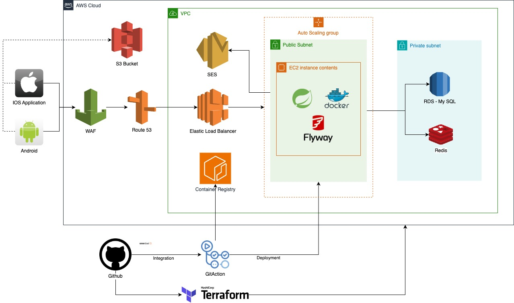

# WEAVE 

> 안전한 대학생 미팅 플랫폼, WEAVE &nbsp;&nbsp; • <b>백엔드</b> 레포지토리

<br>

[](https://sonarcloud.io/summary/new_code?id=Student-Center_weave-server)
[](https://sonarcloud.io/summary/new_code?id=Student-Center_weave-server)
[](https://sonarcloud.io/summary/new_code?id=Student-Center_weave-server)
[](https://sonarcloud.io/summary/new_code?id=Student-Center_weave-server)
[](https://sonarcloud.io/summary/new_code?id=Student-Center_weave-server)

---

## 🌟 새로운 만남의 시작, WEAVE(위브)로 여러분을 초대합니다! 🌟

✅️위브만의 특별한 매력
- 안전하고 믿을 수 있는 공간: 대학 이메일 인증으로 진짜 대학생만 만나세요!
- 부담 없는 첫 만남: 프로필 사진은 매칭 후 공개! 귀여운 캐릭터로 자신을 표현해보세요!
- 원하는 대상만 골라서: 미팅 상대의 조건을 제한하고 원하는 상대를 찾아보세요!

🚀새로운 친구와의 만남을 위해 WEAVE를 선택하세요! 함께 특별한 순간을 만들어보세요! 🚀

- 앱스토어 다운로드 : https://apps.apple.com/kr/app/weave-위브/id6477753039
- 플레이스토어 다운로드: https://play.google.com/store/apps/details?id=com.studentcenter.weave

<p float="left">   </p> <p float="left">   </p>

---

## 🏗 Git Convention

### 🎋 Branch Strategy

- main : 개발 브렌치
- release : 배포 브렌치
- feature/{ticket id} : 기능 개발 브렌치

### PR Naming Convention

[{지라 티켓 id}] {jira ticket name}
ex) [WEAV-15] github 설정 수정

### Commit Message convention(optional)

[{지라 티켓 id}] {gitmoji} {commit message}
ex) [WEAV-15] github 설정 수정

**githook 설정 방법**

```bash
sh ./.githooks/install.sh
```

## 🛰️ Architecture

### Infrastructure - AWS


